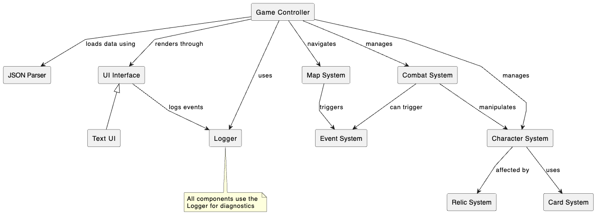

# Component Diagram

## Overview

Deckstiny is organized into several major components that interact with each other to create the complete game experience. The component diagram illustrates the high-level organization of the system and the relationships between its major parts.

## Component Diagram

## Component Descriptions

### 1. Game Core

The Game Core contains the central control mechanisms of the game:

- **Game Controller**: Manages the game state, progression, and top-level flow between different game modes (menu, combat, map, etc.). It also contains data loading functionality that populates game entities from JSON files.
- **Combat System**: Handles all aspects of card-based combat, including turn management, effect resolution, and win/loss conditions.
- **Map System**: Manages the procedural generation and navigation of the game map, tracking player position and available paths.
- **Event System**: Controls random encounters and their outcomes based on player choices.

### 2. Game Entities

The Game Entities component encompasses all the game objects that interact during gameplay:

- **Character System**: Manages both player characters and enemies, including their stats, abilities, and state.
- **Card System**: Handles all card-related functionality, including card definitions, deck management, and card effects.
- **Relic System**: Manages the collection and effects of relics that provide passive bonuses to the player.

### 3. Data Management

The Data Management component handles parsing of game data:

- **JSON Parser**: Utilizes nlohmann::json to parse and process JSON data files. The Game Controller uses this to load game data.

### 4. UI Layer

The UI Layer handles user interaction and display:

- **UI Interface**: An abstract interface that defines how the game communicates with the user.
- **Text UI Implementation**: The current concrete implementation providing a text-based user interface.

### 5. System Services

The System Services component provides core infrastructure services:

- **Logger**: A singleton service that manages application-wide logging for debugging and diagnostics.

## Component Interactions

1. **Game Core to Game Entities**: The Game Core components manage and orchestrate interactions between Game Entities. For example, the Combat System manages how cards affect characters during battle.

2. **Game Entities to Data Management**: Game entities are populated with data loaded by the Game Controller, which uses the JSON Parser to read from JSON configuration files.

3. **Game Core to UI Layer**: The Game Core communicates with the UI Layer to display game state and receive user input. This interaction is abstracted through the UI Interface, allowing for different UI implementations.

4. **Data Flow**: Data typically flows from the JSON files, through the Game Controller's loading functions, into the Game Entities, and is then manipulated by the Game Core based on player actions received through the UI Layer.

5. **Logging and Diagnostics**: All components utilize the Logger service for diagnostics, error reporting, and debugging information.

## Extensibility Points

The component architecture provides several key points for extension:

1. **New UI Implementations**: Additional UI implementations can be created by implementing the UI Interface.

2. **New Game Entities**: The system can be extended with new cards, enemies, relics, and events without modifying the core architecture.

3. **Enhanced AI**: The Combat System can be extended with more sophisticated enemy AI behaviors.

4. **New Game Modes**: Additional game modes can be added through extensions to the Game Controller.

5. **Diagnostic Enhancements**: The Logger can be extended to support additional logging destinations or formats. 