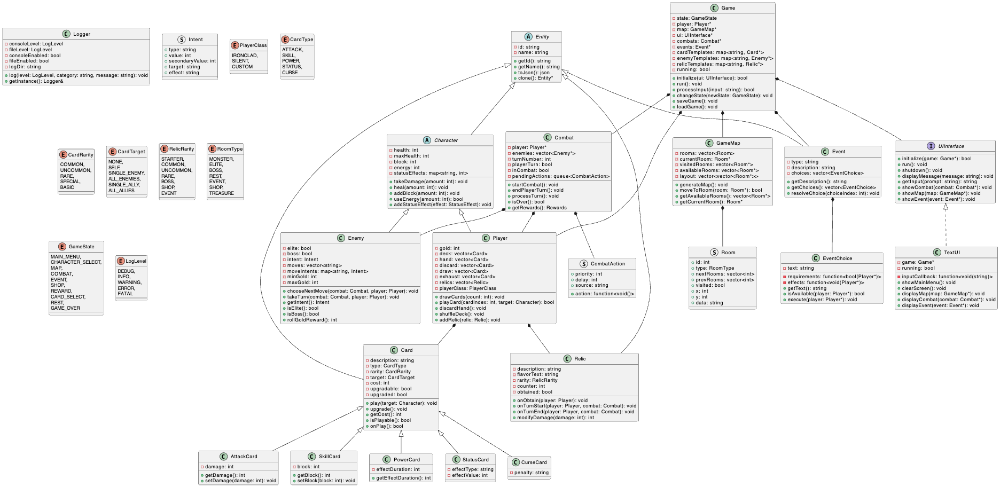

# Class Diagram

## Overview

Deckstiny features a rich class hierarchy that models the various game elements. This document provides a comprehensive class diagram showing the inheritance relationships and key interactions between classes.

## Class Diagram

## Class Hierarchy

### Core Entity Hierarchy

The `Entity` class serves as the base class for all game objects, providing:
- Unique identifier
- Name
- Methods for JSON serialization and cloning

From this base class, several primary game elements are derived:
- Cards
- Characters
- Relics
- Events

### Card Hierarchy

The `Card` class extends `Entity` and represents playable cards:

- **Properties**:
  - Description
  - Card type (Attack, Skill, Power, etc.)
  - Rarity
  - Target type
  - Energy cost
  - Upgrade status

- **Card Type Subclasses**:
  - **AttackCard**: Cards that deal damage to enemies
  - **SkillCard**: Cards that provide defensive or utility effects
  - **PowerCard**: Cards that provide persistent effects
  - **StatusCard**: Cards that represent temporary status effects
  - **CurseCard**: Cards with negative effects

### Character Hierarchy

The `Character` class extends `Entity` and serves as the base for all characters in the game:

- **Properties**:
  - Health and maximum health
  - Block (defense)
  - Energy (resource for playing cards)
  - Status effects

- **Player Class**:
  - Extends Character with player-specific functionality
  - Manages the player's deck, hand, discard, and draw piles
  - Handles gold and relics
  - Provides methods for playing cards and managing resources

- **Enemy Class**:
  - Extends Character with enemy-specific functionality
  - Contains AI behavior through the `chooseNextMove` method
  - Manages intents that signal upcoming actions
  - Tracks elite and boss status

### Relic Hierarchy

The `Relic` class extends `Entity` and represents items that provide passive bonuses:

- **Properties**:
  - Description
  - Flavor text
  - Rarity
  - Obtained status
  - Counter for tracking activation conditions

### Supporting Classes

- **Combat**: Manages combat encounters between the player and enemies
- **Game**: Central controller class that manages game state and flow
- **GameMap**: Handles the procedural generation and navigation of the game map
- **Event**: Represents random encounters with choices and outcomes
- **EventChoice**: Represents individual choices in an event with requirements and effects
- **UIInterface**: Abstract interface for UI implementations
- **TextUI**: Concrete implementation of the UI interface providing text-based interaction
- **Logger**: Singleton class for handling logging throughout the application
- **Room**: Structure representing a single room on the map
- **Intent**: Structure representing an enemy's intended action
- **CombatAction**: Structure representing a scheduled action in combat

### Enum Classes

The diagram also includes key enum classes that define important types in the system:
- **PlayerClass**: Different character classes the player can choose
- **CardType**: Types of cards (Attack, Skill, Power, etc.)
- **CardRarity**: Rarity levels for cards
- **CardTarget**: Targeting options for cards
- **RelicRarity**: Rarity levels for relics
- **RoomType**: Types of rooms on the map
- **GameState**: States in the game state machine
- **LogLevel**: Severity levels for logging

## Key Relationships

1. **Entity Inheritance**: Card, Character, Relic, and Event all inherit from Entity, providing a common base for all game objects.

2. **Character Specialization**: Player and Enemy classes extend Character with specialized functionality.

3. **Card Specialization**: Different card type classes extend the base Card class with specialized behavior.

4. **Game Orchestration**: The Game class coordinates between Combat, Map, and Event systems, controlling the flow between different game states.

5. **UI Abstraction**: The UIInterface provides an abstraction layer for user interaction, with TextUI as the current implementation.

6. **Composition Relationships**:
   - Player contains collections of Cards (deck, hand, discard pile)
   - Player contains collections of Relics
   - Combat contains references to Player and Enemies
   - GameMap contains collections of Rooms
   - Events contain collections of EventChoices

## Extensibility Points

The class hierarchy is designed with extensibility in mind:

1. **New Card Types**: Either through subclassing Card or through data-driven definitions

2. **New Character Classes**: By extending the Player class with specialized behavior

3. **New Enemy Types**: Through subclassing Enemy or through data-driven definitions

4. **New Relic Types**: Either through subclassing Relic or through data-driven definitions

5. **Alternative UI Implementations**: By implementing the UIInterface abstract interface 